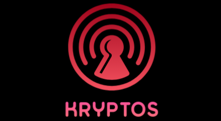

# Kryptos: Secure Password Wallet

<p align="center">
  
</p>


https://github.com/user-attachments/assets/d3eb73ad-f900-4e99-9556-d6feeab2529d


**Kryptos** is a modern, cross-platform password manager built with Go and Fyne, designed to provide a secure and intuitive way to store and manage your passwords locally. For prioritized security and user experience, ensuring your sensitive data is protected while remaining easily accessible. 

## Features

### 🛡️ Security
- AES-GCM-256 encryption for all stored data
- Scrypt key derivation for master passwords
- Secure random salt generation for each save
- Zero-knowledge architecture - all encryption/decryption happens locally

### 👤 Account Management
- Support for multiple user accounts
- Secure master password protection
- Individual encrypted storage for each account
- Easy account creation and deletion

### 🎯 Password Management
- Intuitive password entry creation and editing
- Secure password storage with titles and notes
- Quick copy functionality for usernames and passwords
- Search and filter capabilities
- Tag support for better organization

### 📤 Import/Export
- Secure data export functionality
- Import capability for backup restoration
- Encrypted backup format

## Security 
* **Strong Key Derivation with scrypt:** We use scrypt to derive the encryption key from your master password. Scrypt is computationally expensive and resistant to brute-force attacks, even if an attacker gains access to the encrypted data.
* **Salting:**  A unique, randomly generated salt is used for each account, further enhancing the security of key derivation.


## Getting Started

### Prerequisites

* **Go:** [Go 1.20 or higher](https://go.dev/dl/) is required to build Kryptos.
* **Fyne Dependencies:** Ensure you have the necessary dependencies for Fyne development set up on your system. Refer to the [Fyne Getting Started Guide](https://developer.fyne.io/started/) for detailed instructions for your operating system.

### Installation

**1. Build from Source:**

```bash
git clone https://github.com/<your-github-username>/kryptos.git
cd kryptos
go build -o kryptos
```

This will create an executable file named `kryptos` (or `kryptos.exe` on Windows) in your project directory.

**2. Download Pre-built Binaries**

You can download pre-built binaries for your operating system from the [Releases]([https://github.com]) page. Choose the appropriate binary for your platform and follow your operating system's instructions for running executables.

## Contributing

We welcome contributions to Kryptos! If you'd like to contribute, please:

1. Fork the repository.
2. Create a new branch for your feature or bug fix.
3. Make your changes and commit them with clear and concise commit messages.
4. Submit a pull request to the `main` branch.

Please review our [Contributing Guidelines](CONTRIBUTING.md) for more details on how to contribute.

## License

Kryptos is released under the [MIT License](LICENSE). 

## Contact

For questions, bug reports, or feature requests, please open an issue on GitHub or contact me at [Email](mailto:jeninsutradhar@gmail.com).

---

**Disclaimer:** Kryptos is provided as-is, without warranty of any kind. Use at your own risk. The developers are not responsible for any data loss or security breaches that may occur as a result of using this software.
